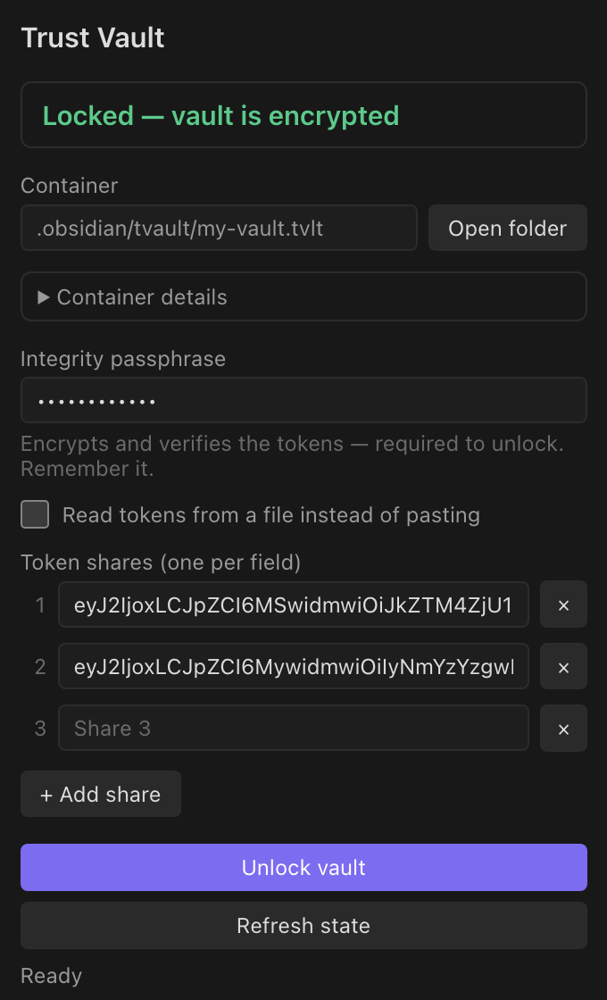
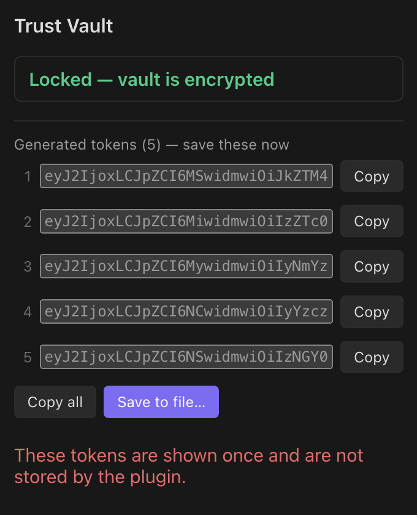
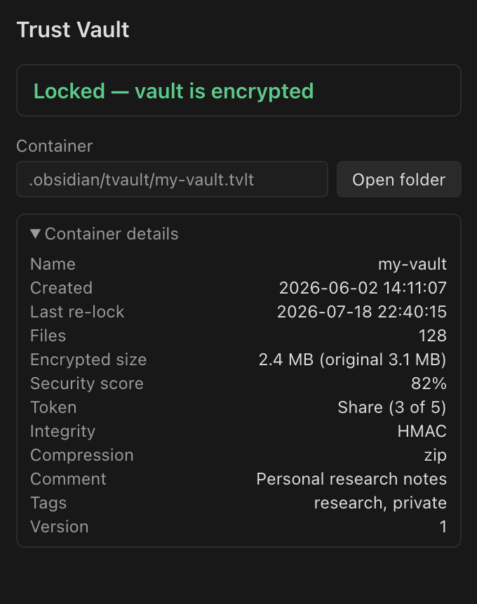
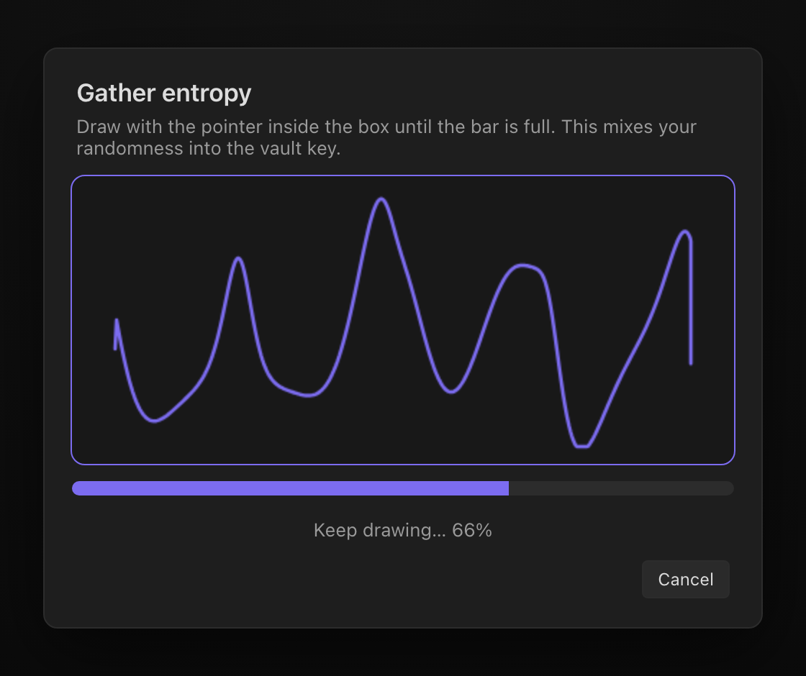

# Trust Vault for Obsidian

Desktop-only Obsidian plugin that wraps the `tvault-core` CLI and turns a vault
into a lockable safe: **Lock** encrypts your notes into a container and removes
the plaintext; **Unlock** restores the notes from the container.

Website: [tvault.app](https://tvault.app)

## Screenshots

**Side panel** — the current state and one primary action (lock when unlocked,
unlock when locked):



**Generated tokens** — save the Shamir shares to a file, or copy each share
individually:



**Container details** — created / last re-lock, size, security score, token type,
shares / threshold and more:



**Gathering entropy** — draw inside the box to mix randomness into the container
key:



## The lock / unlock model

- **Unlocked** — plaintext notes are present in the vault.
- **Locked** — notes are encrypted in the container; only `.obsidian`
  (Obsidian config and this plugin) remains in the vault.

The `.obsidian` directory is **never** encrypted or removed: on lock the plugin
moves the notes into a temporary staging folder and packs only that, so the
plugin, its settings, and the bundled binary stay in place across a lock/unlock
cycle.

## Side panel

Open the **Trust Vault** side panel from the ribbon (shield icon) or the
**Trust Vault: Open Trust Vault panel** command. It shows the current state and one
primary action:

- When **unlocked**, the button **locks** the vault (first lock creates the
  container with `seal`; later locks update it with `reseal`).
- When **locked**, the button **unlocks** the vault (`unseal`).

Fields adapt to the action and the container's token type:

- **Container passphrase** — only for `none` (passphrase-only) vaults, where it
  is the single secret. For `share` / `master` the container key is generated
  with 256-bit entropy (see "Passphrases and entropy" below), so no container
  passphrase is asked.
- **Integrity passphrase** — for `share` / `master`, this encrypts and verifies
  the tokens and is required to unlock. Choose a strong one and remember it.
- **Tokens** — to unlock or re-lock a `share` / `master` vault, **paste the
  token shares** (one per line, or the `{"token_list": [...]}` JSON from a
  previous lock). Enough shares to meet the threshold are required. A **Read
  tokens from a file** checkbox uses a file path instead.
- After the first lock the generated tokens are shown once with a **Copy
  tokens** button — save them immediately, they are not stored.

The token type is chosen only for a brand-new container; for an existing one it
is read from the container header, so you never have to remember it.

## Safety

A lock never loses data:

1. Notes are moved into `.tvault-stage`; the container is written from there.
2. The container is verified with `tvault-core container info` — its
   `file_count` must match the number of staged files.
3. Only then is the staged plaintext deleted.

If the CLI fails, verification fails, or the app is interrupted mid-lock, the
notes are restored from staging (on the next load if necessary) and the
plaintext is kept.

## Commands

- **Trust Vault: Open Trust Vault panel** — open the side panel.
- **Trust Vault: Lock vault** — encrypt notes and remove plaintext.
- **Trust Vault: Unlock vault** — restore notes from the container.
- **Trust Vault: Lock and close vault** — lock, then close the Obsidian window.

Command-palette actions use a single passphrase (reused for container and
integrity) and read/write tokens via the token-file path in settings. The side
panel is the flexible path for pasted tokens.

Passphrases and pasted tokens are never persisted by the plugin. The executable
is launched directly without a shell. The current `tvault-core` CLI accepts
passphrases only as command-line flags, so a secret can be briefly visible to
local process-inspection tools while an operation is running.

## How the CLI binary is delivered

The plugin ships only `main.js`, `manifest.json`, and `styles.css`. On first use
it downloads the `tvault-core` binary for the current platform from the pinned
`tvault-core` release, **verifies it against a SHA-256 checksum baked into
`main.js`**, and caches it under the plugin folder. The release to download from
is pinned in `cli.json` (`repo` + `version`); the expected checksums live in
`cli-checksums.json` and are embedded at build time by `esbuild.config.mjs`.

To use your own build instead, set an absolute path in the plugin settings.

## Build

```sh
cd obsidian-plugin
npm install
npm run build          # builds only the plugin (main.js)
npm run build:cli      # cross-compiles the CLI into bin/ + refreshes cli-checksums.json (needs Go)
npm run bundle         # both of the above
```

The CLI binaries are published by the `tvault-core` repository's
`Release CLI binaries` workflow (tag `vX.Y.Z`), which cross-compiles
darwin/linux/windows on amd64 and arm64. The plugin's own `Release plugin`
workflow (tag `X.Y.Z`) builds and attaches `main.js`, `manifest.json`, and
`styles.css`.

Releasing a new CLI version:

1. bump `version` in `cli.json` to the new `tvault-core` release tag;
2. run `npm run build:cli` and commit the refreshed `cli-checksums.json`;
3. run `npm run build` and cut the plugin release.

## Install (manual / BRAT)

Copy `manifest.json`, `main.js`, and `styles.css` into
`<vault>/.obsidian/plugins/tvault/`, then enable **Trust Vault** in Obsidian's
community-plugin settings. The binary downloads on first use.

## Configuration

Everything has a working default, so the plugin runs with no configuration:

1. **tvault-core executable** — empty uses the binary bundled with the plugin;
   set an absolute path (or a PATH command name) to override.
2. **Container path** — empty stores it at `.obsidian/tvault/<vault>.tvlt`, which
   is preserved on lock and never sealed into itself, keeping the vault portable.
   You may instead set an absolute path outside the vault. A container must never
   live in the note area (it would be encrypted into itself and then deleted); it
   is only allowed outside the vault or inside `.obsidian`.
3. **Token file path** — empty stores it at `.obsidian/tvault/<vault>.keys.json`,
   used by the command palette and the panel's token-file option (not used with
   token type `none`).

The default token mode for a new container is Shamir `share` with 5 shares and a
threshold of 3.

## Passphrases and entropy

- **`none`** — the container passphrase is the only secret; choose a strong one.
- **`share` / `master`** — the container's master key is generated with 256-bit
  entropy and split into the tokens; it is never shown or reused, because a
  human-chosen container passphrase would be a brute-forceable backdoor around
  the Shamir scheme.
  - **Entropy by drawing** (setting, on by default): on a first lock you are
    asked to draw in a box; those pointer samples are hashed together with the
    system CSPRNG to form the key — it is never weaker than `crypto.randomBytes`
    alone, the drawing only adds entropy.
  - **Integrity passphrase** (toggle when creating the container): when on, the
    tokens are encrypted with it, so unlocking needs enough tokens **and** that
    passphrase (a leaked token file is useless without it — use a strong one).
    When off, the tokens alone unlock the vault with no passphrase; keep them
    safe. Existing containers keep whichever setting they were created with.

**Security note.** Because the tokens are encrypted with the integrity
passphrase, storing the token file inside the vault (the default) is protected
by that passphrase. For stronger separation you can still keep the token file
outside the vault, or use pasted tokens (the panel default), which never writes
a token file.

Keep independent backups of the container and token file. Losing the required
token shares or the integrity passphrase makes the encrypted data unrecoverable.
